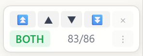
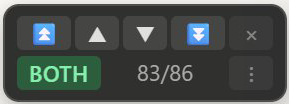

# AI ChatNav

[](https://github.com/djdarcy/aichatnav)
[](src/manifest.json)
[](docs/keyboard-shortcuts.md)

**Stop scrolling, start jumping.** Navigate between user and AI messages in ChatGPT and Claude.ai with keyboard shortcuts and a compact floating widget.

## The Problem

Long AI chat conversations require tedious scrolling to find specific user prompts or AI responses. You know you asked something 20 messages ago, but finding it means scrolling past walls of text, code blocks, and images. There's no built-in way to jump between your own messages.

**AI ChatNav** adds a floating navigation widget and keyboard shortcuts that let you jump directly between messages -- yours, the AI's, or both.

## Quick Start

1. Clone this repo
2. Open Chrome and go to `chrome://extensions/`
3. Enable **Developer mode** (top-right toggle)
4. Click **Load unpacked** and select the `src/` directory
5. Navigate to ChatGPT or Claude.ai

That's it. A compact widget appears near the text input bar:

&nbsp;&nbsp;&nbsp;&nbsp; &nbsp;&nbsp; 

## Features

- **Three navigation modes**: Jump between User messages, AI messages, or Both
- **Keyboard-driven**: Vim-style Alt+J/K navigation, Ctrl+Alt for first/last
- **Smart positioning**: Widget anchors itself next to each site's text input bar
- **Non-intrusive**: Fades in after page load, compact two-row layout
- **SPA-aware**: Handles chat switching without page reload
- **Visual feedback**: Brief highlight animation on navigated-to messages
- **Zero dependencies**: Plain JS/CSS, no build step, no external calls

## Keyboard Shortcuts

| Shortcut | Action |
|----------|--------|
| Alt+K / Alt+Up | Previous message |
| Alt+J / Alt+Down | Next message |
| Ctrl+Alt+K / Ctrl+Alt+Up | First message |
| Ctrl+Alt+J / Ctrl+Alt+Down | Last message |
| Alt+M | Cycle mode (User -> AI -> Both) |
| Alt+H | Toggle panel visibility |

## Supported Platforms

| Platform | URL | Status |
|----------|-----|--------|
| ChatGPT | chatgpt.com | Supported |
| Claude | claude.ai | Supported |
| Gemini | gemini.google.com | Planned |

## How It Works

AI ChatNav injects a content script on supported sites that:

1. **Detects the site** and loads the appropriate CSS selectors from a config object
2. **Finds messages** in the DOM using site-specific selectors with fallback chains
3. **Tracks position** with a current index into the message list
4. **Navigates** via `scrollIntoView` with smooth scrolling and a brief highlight
5. **Repositions dynamically** by anchoring to the site's text input bar (handles sidebar toggle, window resize)
6. **Handles SPAs** with URL polling and a debounced MutationObserver

The selector config makes it straightforward to add new sites -- just add the hostname and its selectors.

## Installation

### Chrome / Edge / Chromium (Developer Mode)

```bash
git clone https://github.com/djdarcy/aichatnav.git
cd aichatnav
```

Then load `src/` as an unpacked extension in `chrome://extensions/`.

### Chrome Web Store

Coming soon.

## Development

### Prerequisites

- Chrome, Edge, or any Chromium-based browser
- Python 3.x (for version sync scripts)
- Node.js (for Playwright tests, optional)

### Project Structure

```
src/
  manifest.json       # Chrome Manifest V3
  content.js          # Navigation logic, UI injection, site configs
  styles.css          # Floating panel styles
  icons/              # Extension icons
scripts/
  sync-versions.py    # Version synchronization (updates manifest + _version.py)
  install-hooks.sh    # Git hook installer
  hooks/              # pre-commit, post-commit, pre-push
aichatnav/
  _version.py         # Version source of truth
tests/
  one-offs/           # Playwright layout tests, exploratory scripts
docs/
  keyboard-shortcuts.md
```

### Setup

```bash
# Install git hooks (version sync, private content protection, quality checks)
bash scripts/install-hooks.sh

# Install Playwright for layout tests (optional)
npm install
npx playwright install chromium

# Run layout tests
node tests/one-offs/test_widget_layout.js
```

### Version Management

```bash
# Check if versions are in sync
python scripts/sync-versions.py --check

# Bump patch version
python scripts/sync-versions.py --bump patch

# Sync after manual edits
python scripts/sync-versions.py
```

## Roadmap

- [x] Core navigation (User / AI / Both modes) on ChatGPT + Claude.ai
- [x] Settings page with theme selection and preferences
- [x] Site-matching color themes (light / dark / auto)
- [x] Auto-expand truncated messages on Claude.ai
- [x] Proper extension icons
- [ ] Gemini support
- [ ] Firefox support
- [ ] Chrome Web Store release

See [ROADMAP.md](ROADMAP.md) for the full phased plan, or track progress on [issue #1](https://github.com/djdarcy/aichatnav/issues/1).

## Contributing

Contributions welcome! See [CONTRIBUTING.md](CONTRIBUTING.md).

Like the project?

[](https://www.buymeacoffee.com/djdarcy)

## License

This project is licensed under the terms specified in the LICENSE file.
